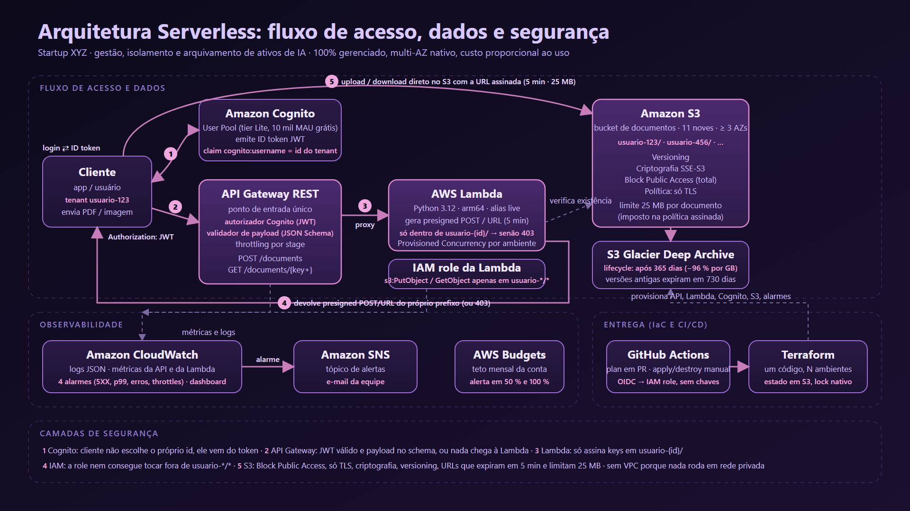

# Startup XYZ: plataforma serverless de documentos

Implementação em Terraform da arquitetura descrita em *Arquitetura Serverless AWS para a Startup XYZ*
(JP2SRT Implantações em Cloud): ingestão e recuperação segura de documentos com isolamento por cliente,
arquivamento automático, observabilidade e custo proporcional ao uso. Projeto de TCC da formação AWS.



Fonte do diagrama em [diagrama.mmd](docs/arquitetura/diagrama.mmd) e [diagrama.svg](docs/arquitetura/diagrama.svg).

## Requisitos e como estão atendidos

| Requisito do PDF | Como está implementado |
|---|---|
| Ingestão via API autenticada | API Gateway REST + autorizador Cognito + validador JSON Schema ([api.tf](terraform/api.tf), [cognito.tf](terraform/cognito.tf)) |
| Isolamento multi-tenant | Prefixo `usuario-{cognito:username}/` imposto no código **e** na política IAM da Lambda ([handler.py](lambda/handler.py), [iam.tf](terraform/iam.tf)) |
| Recuperação segura | Presigned URL de 5 minutos, 403 fora do prefixo, 404 se não existir |
| Upload controlado | Presigned POST com Content-Type fixo e limite de 25 MB imposto pelo S3 |
| Block Public Access | Bloqueio total no bucket + política que nega tráfego sem TLS ([s3.tf](terraform/s3.tf)) |
| Arquivamento após 365 dias | Lifecycle para `DEEP_ARCHIVE`, versões antigas expiram em 730 dias |
| Versioning | Habilitado no bucket de documentos |
| Alta disponibilidade | S3, Lambda, API Gateway e Cognito são multi-AZ por padrão |
| Observabilidade | 4 alarmes CloudWatch com e-mail via SNS + dashboard ([observability.tf](terraform/observability.tf)) |
| Cold start | Provisioned Concurrency por ambiente no alias `live` (0 em demo, 1 em prod) |
| IaC com ambientes idênticos | Um root module, um `envs/<ambiente>.tfvars` por ambiente |
| Pipeline | GitHub Actions via OIDC: validação e plan em PR, apply/destroy manual com confirmação |
| Controle de custos | AWS Budget de US$ 5/mês com alerta; estimativa em [docs/custos/estimativa.md](docs/custos/estimativa.md) |

## Pré-requisitos

- [mise](https://mise.jdx.dev) (instala Terraform, tflint, jq e gh nas versões fixadas em [mise.toml](mise.toml))
- AWS CLI v2 configurada com credenciais da conta (perfil `default`, região `us-east-1`)
- `curl` e `openssl` (já vêm com o Git Bash no Windows)

```bash
mise install
mise run lint
```

## Estrutura

```
terraform/
  bootstrap/        permanentes: bucket de estado, role OIDC do GitHub, tópico SNS, Budget
  envs/             demo.tfvars, dev.tfvars, prod.tfvars
  versions.tf       providers, backend S3 (lock nativo), default_tags
  s3.tf cognito.tf lambda.tf api.tf iam.tf observability.tf outputs.tf variables.tf
lambda/handler.py   Lambda única: POST /documents e GET /documents/{key+}
scripts/            smoke.sh (10 verificações ao vivo) e check-orphans.sh (prova de conta limpa)
docs/adr/           6 decisões de arquitetura
docs/custos/        estimativa mensal por serviço e roteiro do Pricing Calculator
docs/arquitetura/   diagrama (Mermaid, SVG, PNG)
docs/apresentacao/  mudanças no deck para atender ao guia do TCC
RUNBOOK.md          calendário, distribuição de falas, roteiro da demo, recuperação, perguntas da banca
```

## Bootstrap (uma vez por conta)

```bash
mise run bootstrap-plan     # revise o plano (10 recursos)
mise run bootstrap-apply    # bucket de estado, role gh-actions-startup-xyz, SNS, Budget
```

Confirme a assinatura de e-mail do SNS (link recebido em `ti.rbrodrigues@gmail.com`), remova o
`terraform/backend_override.tf` se existir, e configure as variáveis do repositório no GitHub:

```bash
gh variable set AWS_REGION --body us-east-1
gh variable set AWS_STATE_BUCKET --body startup-xyz-tfstate-<conta>
gh variable set TERRAFORM_ROLE_ARN --body arn:aws:iam::<conta>:role/gh-actions-startup-xyz
```

## Ciclo de um ambiente

```bash
mise run plan            # terraform plan do ambiente demo (gera tfplan)
mise run apply           # aplica o tfplan revisado (~2 min, 33 recursos)
mise run smoke           # 10 verificações: upload, download, 403, 401, 400, 404, limite, público, config, alarmes
mise run dashboard       # abre o dashboard CloudWatch
mise run destroy-plan    # plano de destruição
mise run destroy         # aplica a destruição
mise run check-orphans   # falha se sobrar qualquer recurso com as tags do projeto
mise run demo [--pause]  # tudo acima em sequência (ensaio)
```

Outro ambiente: `ENV=dev mise run plan` (usa `envs/dev.tfvars` e a key `dev/terraform.tfstate`).
Plano B pela pipeline: `mise run ci-deploy apply|destroy` dispara o workflow manual.

## API

| Método | Rota | Body / parâmetro | Resposta |
|---|---|---|---|
| `POST` | `/documents` | `{"filename": "contrato.pdf", "content_type": "application/pdf"}` | `201 {key, upload: {method, url, fields}, max_bytes, expires_in}`; `400` se o body fugir do schema |
| `GET` | `/documents/{key+}` | key completa, ex.: `usuario-123/contrato.pdf` | `200 {key, download_url, expires_in}`; `403` se a key for de outro usuário; `404` se não existir |

Header obrigatório: `Authorization: <ID token do Cognito>`. Tipos aceitos: PDF, PNG, JPEG. O upload é um
`POST multipart` para `upload.url` com todos os `upload.fields` seguidos do campo `file`.

## Recuperação

| Cenário | RPO | RTO |
|---|---|---|
| Documento apagado ou sobrescrito por engano | 0 (versão anterior) | minutos |
| Falha de uma zona de disponibilidade | 0 | 0, transparente |
| Perda da aplicação (Lambda, API, Cognito) | 0 | ≈ 2 min via `terraform apply` |
| Documento em Deep Archive | 0 | 12 h (Standard) ou 48 h (Bulk); `mise run restore-example <key>` |
| Falha regional | não coberto na Fase 1 | Fase 2: replicação entre regiões |

## Custo

Ambiente `demo` de ponta a ponta fica abaixo de US$ 0,05: Lambda, Cognito Lite, alarmes e dashboard
estão na faixa gratuita permanente, e API Gateway e S3 cobram frações de centavo por dezenas de
requisições. No cenário do PDF (50 mil documentos/mês) o custo é ≈ US$ 211/mês no mês 12, 99% em
armazenamento e transferência; o lifecycle economiza ≈ US$ 156/mês a partir do ano 2. Detalhes em
[docs/custos/estimativa.md](docs/custos/estimativa.md).

## Roadmap (Fase 2)

Textract e Bedrock por eventos do S3, replicação entre regiões, Object Lock para retenção legal,
usage plans por cliente, CloudFront para downloads.
